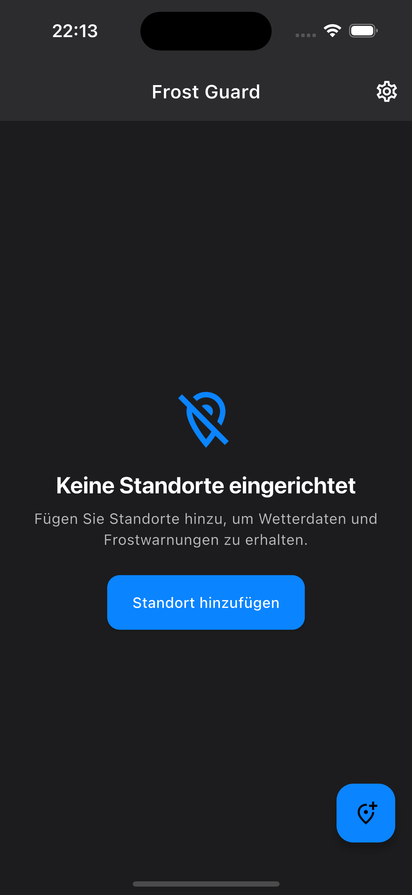
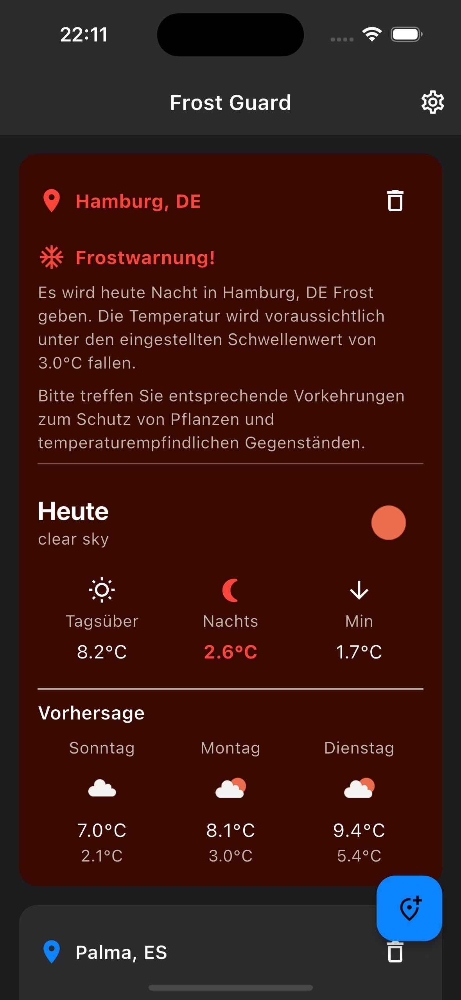
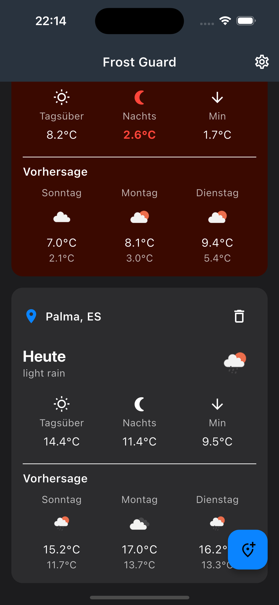
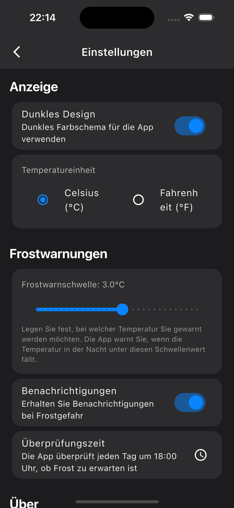
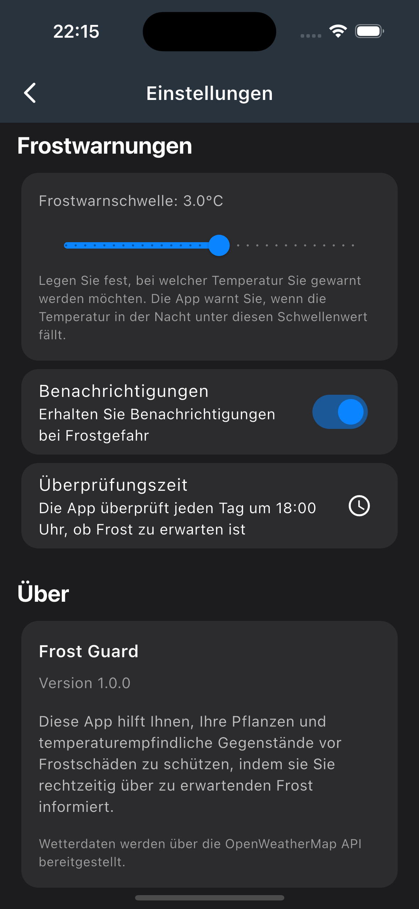
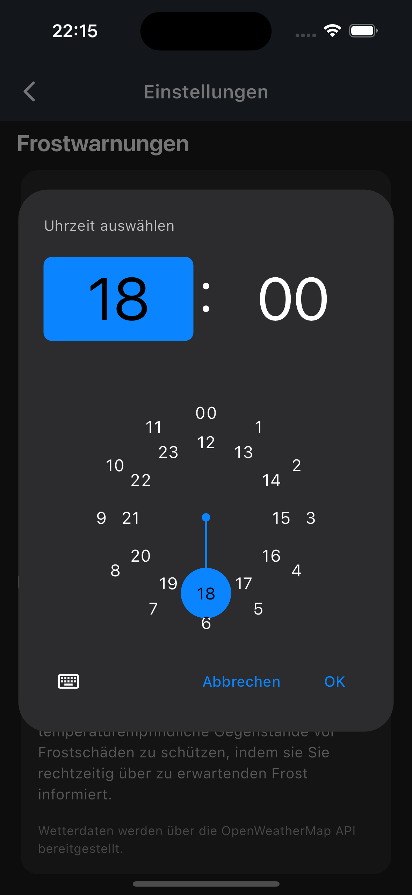

# Frost Guard

Frost Guard is a mobile app that provides frost warnings based on temperature forecasts for various locations. The app is designed for both Android and iOS platforms.

## Features

- Frost warnings based on temperature forecasts
- Support for multiple locations
- Daily background checks for frost warnings
- Test notification feature for debugging
- Modern design with dark mode

## Screenshots

### Startscreen


### Locations


### Locations 2


### Settings


### Settings 2


### Notification


## Technical Information

The app was developed using Flutter and uses the OpenWeatherMap API for weather forecasts.

## Setup

1. Clone this repository
2. Create a `.env` file in the main directory with the following content:
```
OPENWEATHERMAP_API_KEY=xxx

```
3. Run `flutter pub get` to install all dependencies
4. Start the app with `flutter run`

## License

Open Source
